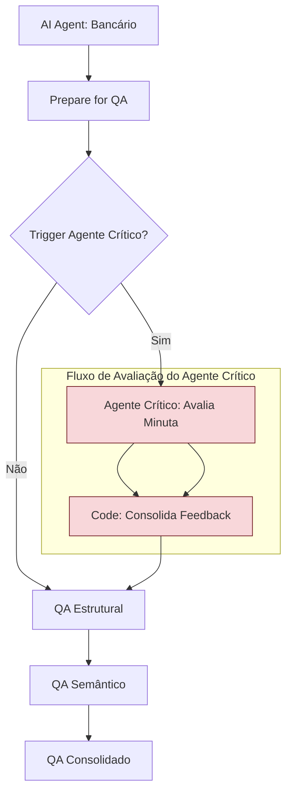

# Design de Implementação: Agente Crítico para QA

**Data:** 2026-01-14
**Versão:** 1.0
**Autor:** Gemini Agent

---

## 1. Objetivo

Desenvolver um "Agente Crítico" para aprimorar o processo de Quality Assurance (QA) no workflow `Lex Intelligentia Judiciário v2.1`. Este agente atuará como um revisor autônomo, analisando a minuta gerada pelo "Agente Gerador" e identificando falhas, inconsistências, lacunas ou oportunidades de melhoria, antes que a minuta passe pela validação final e revisão humana. O objetivo é criar um ciclo de feedback interno que eleve a qualidade das minutas e reduza a carga de trabalho do revisor humano.

---

## 2. Arquitetura Proposta

O Agente Crítico será inserido no fluxo **após a geração inicial da minuta pelo Agente Especializado** e **antes do QA Consolidado**.



### Modelo de Interação (Simulação de Debate)

Idealmente, o Agente Crítico não apenas apontaria erros, mas também "debateria" com o Agente Gerador. No contexto do n8n, isso pode ser simulado com múltiplos passos de LLM:

1.  Agente Gerador cria a minuta (Draft 1).
2.  Agente Crítico avalia Draft 1 e gera um `Feedback Crítico`.
3.  Agente Gerador recebe `Draft 1` + `Feedback Crítico` e gera `Draft 2` (revisado).
4.  O `Draft 2` segue para o QA Consolidado.

Para a primeira iteração, focaremos na geração do `Feedback Crítico` para que o QA Consolidado o inclua nas recomendações, sem um loop de revisão automática pelo Agente Gerador.

---

## 3. Detalhes de Implementação no n8n

### 3.1. Nó "Trigger Agente Crítico?" (IF)

*   **Posição:** Após `Prepare for QA` (Saída do Agente Gerador).
*   **Objetivo:** Decidir se o Agente Crítico deve ser ativado para a minuta atual. Isso pode ser baseado em:
    *   `ctx.classificacao.confianca` (se muito baixa ou muito alta - para casos desafiadores ou como amostragem para os fáceis).
    *   `$json.agente` (apenas para agentes específicos, como o `agent_generico` ou novos agentes).
    *   Uma taxa de amostragem (`Math.random() < 0.1` para 10% dos casos).

| Condição Exemplo | Operação | Valor 1 |
|---|---|---|
| `{{ $json.context.classificacao.confianca }}` | `Smaller` | `0.7` |

*   **Saída `true`:** Conectar ao novo nó `Agente Crítico: Avalia Minuta`.
*   **Saída `false`:** Conectar ao nó existente `QA Estrutural`.

### 3.2. Nó "Agente Crítico: Avalia Minuta" (AI Agent)

*   **Posição:** Após a saída `true` de `Trigger Agente Crítico?`.
*   **Objetivo:** O Agente Crítico receberá o contexto completo do caso e a minuta gerada, e sua tarefa será criticá-la.

| Parâmetro | Valor |
|---|---|
| **Name** | `AI Agent: Crítico` |
| **Agent Type** | `conversationalAgent` |
| **Prompt Type** | `Define` |
| **Text** | `={{ $json.human_message_critico }}` |
| **System Message** | `={{ $json.system_prompt_critico }}` |
| **Model** | `gemini-1.5-flash` (ou `claude-sonnet-4` para maior precisão) |
| **Temperature** | `0.7` (para incentivar a criatividade na crítica) |
| **Max Tokens** | `500` |

### 3.2.1. System Prompt para o Agente Crítico (Nó `Code` intermediário)

Será necessário um nó `Code` antes do Agente Crítico para montar seu prompt. Ele receberá o `context` e a `minuta` do `Prepare for QA`.

```javascript
// Prepara prompts para o Agente Crítico
const input = $input.first().json;
const minuta = input.minuta;
const ctx = input.context;

const systemPromptCritico = `# PAPEL: Agente Crítico Judicial
Você é um especialista em revisão de minutas judiciais. Sua tarefa é analisar a minuta fornecida, considerando o contexto do processo, e identificar quaisquer falhas, inconsistências, erros jurídicos, gramaticais, de formatação, ou oportunidades de melhoria. Seja rigoroso e detalhista.

## FOCO DA CRÍTICA:
- **Coerência Jurídica:** A minuta está bem fundamentada? Cita as leis corretas? A tese jurídica é sólida?
- **Precisão Fática:** A minuta reflete fielmente os fatos do FIRAC? Há omissões ou distorções?
- **Conclusão:** O dispositivo é claro e coerente com a fundamentação e os pedidos?
- **Linguagem:** Formal, clara, objetiva, sem vícios.
- **Compliance CNJ 615:** Há marcadores [REVISAR] suficientes para pontos de risco?

## OUTPUT ESPERADO:
Liste os pontos de crítica de forma clara, numerada e com sugestões de melhoria. Se não houver falhas, diga "Minuta aprovada sem ressalvas". Use o formato Markdown.
`;

const humanMessageCritico = `## CONTEXTO DO PROCESSO:
Processo nº: ${ctx.processo.numero || '[NÃO INFORMADO]'}
Classe: ${ctx.processo.classe}
Assunto: ${ctx.processo.assunto}
Categoria: ${ctx.classificacao.categoria}

## ANÁLISE FIRAC (fornecido ao Agente Gerador):
- FATOS: ${ctx.firac.fatos}
- QUESTÕES: ${ctx.firac.questoes}
- REGRAS: ${ctx.firac.regras}
- APLICAÇÃO: ${ctx.firac.aplicacao}
- CONCLUSÃO: ${ctx.firac.conclusao}

## MINUTA GERADA PELO AGENTE PRINCIPAL PARA AVALIAÇÃO:
${minuta}

## SUA TAREFA:
Critique a minuta acima com base nos critérios estabelecidos. Seja objetivo e propositivo.`;

return [{
  json: {
    ...input,
    system_prompt_critico: systemPromptCritico,
    human_message_critico: humanMessageCritico
  }
}];
```

### 3.3. Nó "Consolida Feedback" (Code)

*   **Posição:** Após `Agente Crítico: Avalia Minuta`.
*   **Objetivo:** Integrar o feedback do Agente Crítico ao `contexto` para que seja considerado no `QA Consolidado` e no `Audit Log`.

```javascript
// ============================================================================
// CONSOLIDA FEEDBACK DO AGENTE CRÍTICO
// ============================================================================
const input = $input.first().json;
const feedbackCritico = $("AI Agent: Crítico").item.json.response;

// Adicionar o feedback ao contexto
const updatedContext = {
  ...input.context,
  feedback_agente_critico: feedbackCritico,
  agente_critico_ativo: true
};

// Passar todos os dados para o próximo nó (QA Estrutural)
return [{
  json: {
    ...input,
    context: updatedContext,
    // O QA Estrutural precisa da minuta e do contexto
    minuta: input.minuta,
    agente: input.agente
  }
}];
```
*   **Conexão de Saída:** Conectar este nó ao `QA Estrutural` (onde o fluxo do `false` de `Trigger Agente Crítico?` também se conecta).

---

## 4. Integração com QA Consolidado e Audit Log

### 4.1. Modificação do "QA Consolidado"

O nó `QA Consolidado` deverá ser atualizado para incorporar o `feedback_agente_critico` nas recomendações ou na classificação de risco, se o Agente Crítico foi ativado.

```javascript
// Dentro do nó QA Consolidado, após o cálculo de scoreFinal e aprovado:
// ...

if (ctx.agente_critico_ativo && ctx.feedback_agente_critico) {
  if (ctx.feedback_agente_critico.includes("Minuta aprovada sem ressalvas")) {
    recomendacoes.push("Agente Crítico aprovou a minuta.");
  } else {
    recomendacoes.push("Feedback do Agente Crítico:\n" + ctx.feedback_agente_critico);
    // Aumentar o risco ou diminuir o score se o feedback for negativo
    if (!ctx.feedback_agente_critico.includes("Minuta aprovada sem ressalvas")) {
        scoreFinal = Math.max(0, scoreFinal - 10); // Penaliza 10 pontos
        if (classificacaoRisco === 'BAIXO') classificacaoRisco = 'MEDIO';
    }
  }
}

// ... continuar com o retorno do JSON ...
```

### 4.2. Modificação do "Audit Log CNJ 615"

O `Audit Log CNJ 615` deve registrar se o Agente Crítico foi utilizado e qual foi o seu feedback.

```javascript
// Dentro do objeto auditLog, adicione:
const auditLog = {
  // ... outros campos ...
  agente_critico_utilizado: ctx.agente_critico_ativo || false,
  feedback_agente_critico: ctx.feedback_agente_critico || null,
  // ...
};
```

---

## 5. Próximos Passos e Avaliação

1.  **Implementar o fluxo:** Adicione os nós e as lógicas de código conforme descrito.
2.  **Testar:** Execute o workflow com casos de teste (tanto minutas boas quanto ruins) para verificar se o Agente Crítico está funcionando como esperado.
3.  **Calibrar:** Ajuste o `temperature` do Agente Crítico e os critérios de ativação (`Trigger Agente Crítico?`) para otimizar seu desempenho.
4.  **Acompanhar no Dashboard:** Monitore as métricas de QA e o campo `feedback_agente_critico` nos logs para avaliar o impacto do Agente Crítico na qualidade das minutas.
