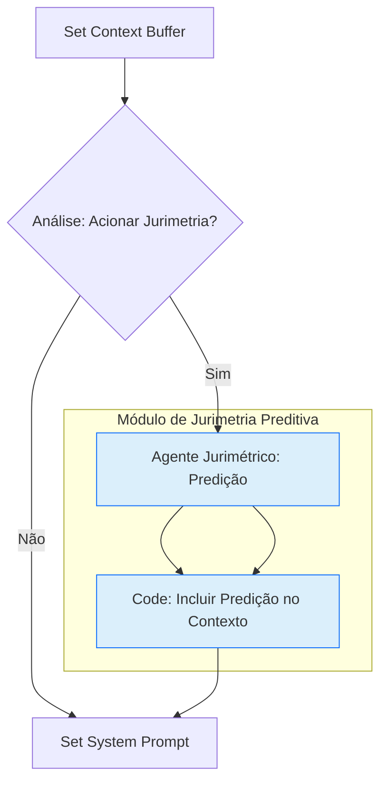

# Plano de Exploração: Análise Jurimétrica Preditiva

**Data:** 2026-01-14
**Versão:** 1.0
**Autor:** Gemini Agent

---

## 1. Objetivo

Explorar a viabilidade e planejar a implementação de um módulo de análise jurimétrica preditiva no sistema Lex Intelligentia Judiciário. O objetivo é utilizar dados históricos de processos para fornecer insights sobre a probabilidade de procedência de pedidos, valores prováveis de condenações e outros desfechos relevantes, auxiliando magistrados e assessores na tomada de decisão e na gestão de expectativas.

---

## 2. Metodologia Proposta

### 2.1. Coleta e Preparação de Dados Históricos

*   **Fontes de Dados:**
    *   **Dados Estruturados de Processos:** Informações do sistema e-Proc, incluindo classe processual, assunto, valor da causa, datas de movimentação, partes, pedidos, resultados de sentenças e decisões, valores de condenações.
    *   **Dados de Minutas e FIRAC:** Os próprios `Audit Logs` do Lex Intelligentia, contendo o FIRAC de entrada e a minuta gerada, podem ser uma fonte rica, especialmente se enriquecidos com feedback humano sobre o resultado real do processo.
    *   **Jurisprudência (RAG):** A base de dados vetorial do STJ pode ser utilizada para identificar precedentes e suas características que influenciaram desfechos passados.
*   **Anonimização e LGPD:** Todos os dados pessoais devem ser anonimizados ou pseudonimizados rigorosamente para conformidade com a LGPD.
*   **Engenharia de Features:** Extrair características relevantes dos dados, como:
    *   Tipo de ação, assunto, pedidos (categorizados).
    *   Palavras-chave e entidades do FIRAC.
    *   Ramo do direito.
    *   Histórico de decisões para tipos de processos similares no tribunal.
    *   Valores monetários (normalizados).
    *   Informações sobre as partes (e.g., reincidência de grandes litigantes - anonimizado).

### 2.2. Modelagem Preditiva

*   **Tipo de Problema:** Classificação (procedência/improcedência) e Regressão (valor da condenação).
*   **Modelos Iniciais (baseline):**
    *   **Classificação:** Regressão Logística, Random Forest, Gradient Boosting (XGBoost/LightGBM).
    *   **Regressão:** Regressão Linear, Random Forest Regressor, Gradient Boosting Regressor.
*   **Modelos Avançados:** Após um baseline, explorar redes neurais (MLPs) ou até modelos de linguagem para extração de features mais complexas a partir de texto livre (se houver).
*   **Validação:** Utilizar técnicas de validação cruzada (Cross-Validation) para garantir a robustez do modelo e métricas como acurácia, precisão, recall, F1-score para classificação, e MAE, MSE, R² para regressão.

### 2.3. Integração com o Workflow

O módulo de jurimetria preditiva seria uma nova "Tool" (ferramenta) acionável pelo Agente Pesquisador ou até mesmo pelos Agentes Especializados, fornecendo a predição como um dado adicional ao `Context Buffer`.

*   **Agente Jurimétrico (AI Agent ou Code Node):** Este nó receberia o `FIRAC` e outros dados estruturados do `context` e acionaria o modelo preditivo (hospedado externamente ou via biblioteca Python). Ele retornaria a predição (probabilidade, faixa de valor).
*   **Nó `Code: Incluir Predição no Contexto`:** Adicionaria o resultado da predição ao `context.jurimetria`.
*   **Adaptação dos Agentes Especializados:** Os prompts dos Agentes Geradores seriam atualizados para considerar essas predições ao redigir a minuta, por exemplo, ajustando a argumentação ou o dispositivo com base na probabilidade de sucesso.

---

## 4. Requisitos de Infraestrutura

*   **Ambiente de Desenvolvimento/Treinamento:** Plataformas de Machine Learning (e.g., Google Vertex AI Workbench, Kaggle, ambientes com GPUs) para o desenvolvimento e treinamento dos modelos.
*   **Hospedagem do Modelo:** Um endpoint para servir o modelo preditivo, como Google Vertex AI Endpoints, AWS SageMaker, ou uma API REST em um servidor próprio.
*   **Armazenamento de Dados:** Um banco de dados robusto (PostgreSQL, BigQuery) para armazenar os dados históricos de forma estruturada e acessível.

---

## 5. Próximos Passos

1.  **Levantamento de Dados:** Iniciar um levantamento detalhado dos dados históricos de processos disponíveis no tribunal e as possibilidades de extração (e.g., via APIs do e-Proc, ou raspagem de dados anonimizados).
2.  **Definição de Métricas de Sucesso:** Esclarecer quais são os KPIs mais importantes para a jurimetria (e.g., acurácia da predição de procedência, erro médio na predição de valor).
3.  **Prova de Conceito (POC):** Desenvolver um modelo preditivo simples (e.g., Regressão Logística para procedência) para um tipo de processo específico (e.g., Contratos Bancários) com um pequeno dataset, para validar a abordagem.
4.  **Integração Prototipada:** Integrar o modelo POC ao workflow n8n como uma ferramenta e testar seu impacto no contexto dos agentes.
5.  **Análise Ética e Viés:** Realizar uma análise rigorosa sobre possíveis vieses nos dados e nos modelos, garantindo que a análise jurimétrica seja justa e não reforce desigualdades.
