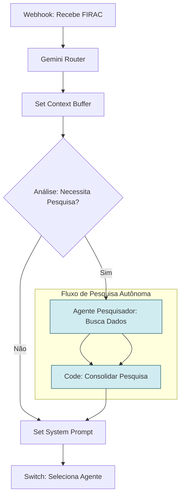

# Design de Implementação: Agente Pesquisador Autônomo

**Data:** 2026-01-14
**Versão:** 1.0
**Autor:** Gemini Agent

---

## 1. Objetivo

Desenvolver um "Agente Pesquisador" autônomo no sistema Lex Intelligentia Judiciário. Este agente terá a capacidade de, para casos complexos ou com lacunas de informação, realizar buscas em fontes de dados externas pré-aprovadas (e.g., Diários Oficiais, sistemas de jurisprudência complementares, bases de dados de legislação) para enriquecer o contexto do processo antes da geração da minuta. O objetivo é fornecer aos agentes especializados um contexto mais completo e atualizado, aumentando a precisão e a robustez das minutas.

---

## 2. Arquitetura Proposta

O Agente Pesquisador será ativado condicionalmente após a etapa de "Set Context Buffer" ou no início da execução de um Agente Especializado (se este identificar uma necessidade de pesquisa). Ele utilizará "Tools" (ferramentas) específicas para cada tipo de fonte de dados externa.



---

## 3. Detalhes de Implementação no n8n

### 3.1. Nó "Análise: Necessita Pesquisa?" (Code ou IF)

*   **Posição:** Após `Set Context Buffer`.
*   **Objetivo:** Determinar se o Agente Pesquisador deve ser acionado. Critérios podem incluir:
    *   `ctx.classificacao.confianca` baixa (menor que 0.6, indicando um caso atípico).
    *   Palavras-chave específicas no `FIRAC` que denotam complexidade ou novidade (e.g., "precedente novo", "revisão de tese").
    *   Ausência de dados específicos (e.g., `ctx.entidades.leis_mencionadas` vazio, mas esperado).
    *   Uma flag explícita no input do webhook (`body.forcar_pesquisa: true`).

```javascript
// Exemplo de lógica para decidir se aciona o pesquisador
const ctx = $input.first().json;
let necessitaPesquisa = false;

if (ctx.classificacao.confianca < 0.6) { // Baixa confiança na classificação inicial
  necessitaPesquisa = true;
} else if (ctx.firac.questoes.includes("novo precedente") || ctx.firac.fatos.includes("tema controvertido")) {
  necessitaPesquisa = true;
}

return [{
  json: {
    ...ctx,
    necessita_pesquisa: necessitaPesquisa
  }
}];
```
*   **Saída `true`:** Conectar ao novo nó `Agente Pesquisador: Busca Dados`.
*   **Saída `false`:** Conectar ao nó existente `Set System Prompt`.
### 3.2. Nó "Agente Pesquisador: Busca Dados" (AI Agent)

*   **Posição:** Após a saída `true` de "Análise: Necessita Pesquisa?" (ou após um nó `Code` que prepara o prompt).
*   **Objetivo:** Este agente será configurado com várias "Tools" para interagir com fontes externas.

| Parâmetro | Valor |
|---|---|
| **Name** | `AI Agent: Pesquisador` |
| **Agent Type** | `conversationalAgent` |
| **Prompt Type** | `Define` |
| **System Message** | `={{ $json.system_prompt_pesquisador }}` |
| **Human Message** | `={{ $json.human_message_pesquisador }}` |
| **Model** | `gemini-1.5-flash` (ou modelo otimizado para RAG) |
| **Temperature** | `0.4` |
| **Max Tokens** | `1000` |
| **Tools** | Configurar ferramentas para cada fonte de dados (ver 3.2.1) |


### 3.2.1. Tools para o Agente Pesquisador

As ferramentas abaixo seriam implementadas como nós `HTTP Request` ou `Code` no n8n, expostos ao Agente Pesquisador via sua configuração de `Tools`:

*   **`busca_jurisprudencia_stj` (já implementada na Fase 1):**
    *   **Descrição:** "Busca jurisprudência relevante do STJ por similaridade semântica. Use para encontrar precedentes, teses e acórdãos sobre um tema específico."
    *   **Endpoint:** `{{ $env.N8N_WEBHOOK_URL + 'stj-search' }}`

*   **`busca_diario_oficial` (Nova Ferramenta):**
    *   **Descrição:** "Busca publicações relevantes em Diários Oficiais estaduais e federais. Útil para localizar intimações, decisões específicas ou atos normativos recentes."
    *   **Endpoint:** `https://api.diariosoficiais.com.br/search` (exemplo, API real pode variar)
    *   **Parâmetros (exemplo):** `query: string`, `data_inicio: date`, `data_fim: date`, `estado: string`

*   **`consulta_legislacao` (Nova Ferramenta):**
    *   **Descrição:** "Consulta textos completos de leis, decretos ou súmulas. Ideal para verificar a redação exata de um dispositivo legal."
    *   **Endpoint:** `https://api.legislacao.gov.br/fulltext` (exemplo)
    *   **Parâmetros (exemplo):** `tipo: string`, `numero: string`, `ano: string`

### 3.2.2. Prompts para o Agente Pesquisador (Nó `Code` intermediário)

```javascript
// Prepara prompts para o Agente Pesquisador
const input = $input.first().json;
const ctx = input.context;

const systemPromptPesquisador = `# PAPEL: Agente Pesquisador Judicial Autônomo
Você é um especialista em busca de informações jurídicas. Sua tarefa é, com base no contexto do processo e nas lacunas identificadas, utilizar as ferramentas disponíveis para coletar dados relevantes (jurisprudência, legislação, publicações em diários). Seu objetivo é enriquecer o contexto para o Agente Gerador.

## ESTRATÉGIA DE PESQUISA:
1. Analise o caso e identifique quais informações são ausentes ou insuficientes.
2. Selecione a ferramenta mais apropriada para a busca.
3. Formule queries claras e precisas para as ferramentas.
4. **SEMPRE** use as ferramentas antes de tentar responder.
5. Se uma busca inicial não for suficiente, refine a query e tente novamente.

## OUTPUT ESPERADO:
Um resumo conciso das informações encontradas e relevantes para o caso, no formato Markdown, ou a declaração de que a pesquisa não encontrou dados relevantes. Não gere minutas, apenas informações.
`;

const humanMessagePesquisador = `## CONTEXTO DO PROCESSO:
Processo nº: ${ctx.processo.numero || '[NÃO INFORMADO]'}
Classe: ${ctx.processo.classe}
Assunto: ${ctx.processo.assunto}
Necessidade de Pesquisa: ${ctx.necessita_pesquisa ? 'SIM' : 'NÃO'}

## ANÁLISE FIRAC:
- FATOS: ${ctx.firac.fatos}
- QUESTÕES: ${ctx.firac.questoes}
- REGRAS: ${ctx.firac.regras}
- APLICAÇÃO: ${ctx.firac.aplicacao}
- CONCLUSÃO: ${ctx.firac.conclusao}

## TAREFA:
Com base neste contexto, quais informações adicionais você buscaria para fortalecer a análise jurídica? Use as ferramentas disponíveis para encontrar essas informações.
`;

return [{
  json: {
    ...input,
    system_prompt_pesquisador: systemPromptPesquisador,
    human_message_pesquisador: humanMessagePesquisador
  }
}];
```

### 3.3. Nó "Consolidar Pesquisa" (Code)

*   **Posição:** Após `Agente Pesquisador: Busca Dados`.
*   **Objetivo:** Adicionar os resultados da pesquisa ao `contexto` do processo para que os Agentes Especializados possam utilizá-los.

```javascript
// ============================================================================
// CONSOLIDA RESULTADOS DA PESQUISA
// ============================================================================
const input = $input.first().json;
const resultadosPesquisa = $(\'AI Agent: Pesquisador\').item.json.response;

const updatedContext = {
  ...input.context,
  resultados_pesquisa: resultadosPesquisa,
  pesquisador_ativo: true
};

return [{
  json: {
    ...input,
    context: updatedContext
  }
}];
```
*   **Conexão de Saída:** Conectar este nó ao `Set System Prompt` (onde o fluxo do `false` de "Análise: Necessita Pesquisa?" também se conecta).

---

## 4. Adaptação dos Agentes Especializados

Os System Prompts dos Agentes Especializados precisarão ser atualizados para instruí-los a utilizar os `resultados_pesquisa` disponíveis no `contexto` ao gerar as minutas.

```markdown
// Exemplo de adição ao System Prompt de um Agente Especializado:
# AGENTE: [NOME DO AGENTE]

## CONTEXTO RECEBIDO (ADICIONAL):
- `resultados_pesquisa`: Informações coletadas pelo Agente Pesquisador.

## REGRAS OBRIGATÓRIAS (ADICIONAIS):
1. **SEMPRE** considere os `resultados_pesquisa` para complementar sua análise e fundamentação.
2. Citar expressamente a jurisprudência ou legislação encontrada pelo Agente Pesquisador, se relevante.
```

---

## 5. Próximos Passos e Avaliação

1.  **Implementar Ferramentas Externas:** Desenvolver os endpoints (ou wrappers) para `busca_diario_oficial` e `consulta_legislacao` que o Agente Pesquisador irá consumir.
2.  **Integrar o Agente Pesquisador:** Adicionar os nós e as lógicas de código conforme descrito no workflow n8n.
3.  **Testar:** Criar casos de teste que simulem cenários onde a pesquisa é necessária e avaliar a qualidade das informações retornadas e como elas impactam a minuta final.
4.  **Monitorar:** Acompanhar o uso do Agente Pesquisador e a qualidade das minutas resultantes via dashboard.
